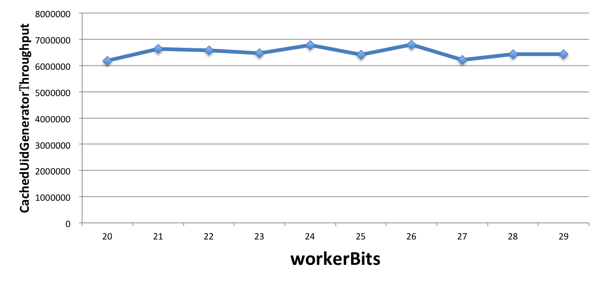

# UidGenerator
UidGenerator 是 [UidGenerator](https://github.com/baidu/uid-generator) 的 C#版本

UidGenerator 是 C# 实现的, 基于 [Snowflake](https://github.com/twitter/snowflake)算法的唯一ID生成器。UidGenerator以组件形式工作在应用项目中,
支持自定义 workerId 位数和初始化策略, 从而适用于 [docker](https://www.docker.com/) 等虚拟化环境下实例自动重启、漂移等场景。
在实现上,  UidGenerator 通过借用未来时间来解决 sequence 天然存在的并发限制; 采用 RingBuffer 来缓存已生成的UID, 并行化UID的生产和消费,
同时对 CacheLine 补齐，避免了由 RingBuffer 带来的硬件级「伪共享」问题. 最终单机 QPS 可达<font color=red>600万</font>。

依赖版本：.NET Framework 4.5 及以上 .NET Core 全部版本
[SQLServer](https://www.microsoft.com/en-us/sql-server/sql-server-downloads)/[MySQL](https://dev.mysql.com/downloads/mysql/)(内置WorkerID分配器, 启动阶段通过 DB 进行分配; 如自定义实现, 则 DB 非必选依赖）

Snowflake算法
-------------
  
Snowflake 算法描述：指定机器 & 同一时刻 & 某一并发序列，是唯一的。据此可生成一个64 bits的唯一ID（long)。默认采用上图字节分配方式：

* sign(1bit)  
  固定1bit符号标识，即生成的UID为正数。

* delta seconds (28 bits)  
  当前时间，相对于时间基点"2016-05-20"的增量值，单位：秒，最多可支持约8.7年

* worker id (22 bits)  
  机器id，最多可支持约420w次机器启动。内置实现为在启动时由数据库分配，默认分配策略为用后即弃，后续可提供复用策略。

* sequence (13 bits)   
  每秒下的并发序列，13 bits可支持每秒8192个并发。
  

**以上参数均可通过 Options 进行自定义**


CachedUidGenerator
-------------------
RingBuffer 环形数组，数组每个元素成为一个 slot。RingBuffer 容量，默认为 Snowflake 算法中 sequence 最大值，且为2^N。可通过```boostPower```配置进行扩容，以提高 RingBuffer
读写吞吐量。

Tail 指针、Cursor 指针用于环形数组上读写 slot：

* Tail 指针  
  表示 Producer 生产的最大序号(此序号从0开始，持续递增)。Tail 不能超过 Cursor，即生产者不能覆盖未消费的 slot。当 Tail 已赶上curosr，此时可通过```rejectedPutBufferHandler```指定 PutRejectPolicy
  
* Cursor 指针  
  表示 Consumer 消费到的最小序号(序号序列与 Producer 序列相同)。Cursor 不能超过 Tail，即不能消费未生产的 slot。当Cursor已赶上 tail，此时可通过```rejectedTakeBufferHandler```指定 TakeRejectPolicy

  

CachedUidGenerator 采用了双 RingBuffer，Uid-RingBuffer 用于存储 Uid、Flag-RingBuffer 用于存储 Uid 状态(是否可填充、是否可消费)

由于数组元素在内存中是连续分配的，可最大程度利用 CPU cache 以提升性能。但同时会带来「伪共享」FalseSharing 问题，为此在Tail、Cursor 指针、Flag-RingBuffer 中采用了 CacheLine 补齐方式。

 

#### RingBuffer 填充时机 ####
* 初始化预填充  
  RingBuffer 初始化时，预先填充满整个 RingBuffer.
  
* 即时填充  
  Take消费时，即时检查剩余可用 slot 量(```tail``` - ```cursor```)，如小于设定阈值，则补全空闲 slots。阈值可通过```paddingFactor```来进行配置，请参考 Quick Start 中 CachedUidGenerator 配置
  
* 周期填充  
  通过 Schedule 线程，定时补全空闲 slots。可通过```scheduleInterval```配置，以应用定时填充功能，并指定 Schedule 时间间隔


Quick Start
------------

这里介绍如何使用本项目 , 具体流程如下:

### 步骤1: 安装依赖
先下载  [.NET Framework](https://dotnet.microsoft.com/en-us/download/dotnet-framework)/[.NET Core](https://dotnet.microsoft.com/en-us/download/dotnet)、[SQLServer](https://www.microsoft.com/en-us/sql-server/sql-server-downloads)/[MySQL](https://dev.mysql.com/downloads/mysql/)。如需运行示例项目，需要 [.NET 6](https://dotnet.microsoft.com/en-us/download/dotnet/6.0) 及以上

### 步骤2: 运行示例单测

运行单测 [CachedUidGeneratorTest](test/Vincent.UidGenerator.Tests/CachedGeneratorTests.cs), 展示UID生成、解析等功能

```java
[Test]
public void ShouldBeGetUidNormallyWhenSerialized()
{
    // Generate UID serially
    ConcurrentDictionary<long, byte> uidSet = new ConcurrentDictionary<long, byte>();
    for (int i = 0; i < SIZE; i++)
    {
        DoGenerate(uidSet, i);
    }
    // Check UIDs are all unique
    CheckUniqueId(uidSet);
}
```

## 项目集成

可通过以下步骤，集成到你的项目中

### 步骤1: 创建表 UidWorkerNode

运行 sql 脚本以导入表 UidWorkerNode , 脚本如下:

#### SQLServer 

```sql
CREATE TABLE [dbo].[UidWorkerNode] (
  [Id]         BIGINT        IDENTITY (1025, 1) NOT NULL,
  [HostName]   VARCHAR (100) NOT NULL,
  [Ip]         VARCHAR (100) NOT NULL,
  [Type]       INT           DEFAULT ((0)) NOT NULL,
  [LaunchDate] DATETIME      DEFAULT (getdate()) NOT NULL,
  CONSTRAINT [PK_UidWorkerNode] PRIMARY KEY CLUSTERED ([Id] ASC)
  );
```

#### MySQL

```sql
create table UidWorkerNode
(
    Id         bigint auto_increment primary key,
    HostName   varchar(100) charset utf8mb3 default '''' not null,
    Ip         varchar(100) default '''' not null,
    Type       int          default 0    not null,
    LaunchDate timestamp    default CURRENT_TIMESTAMP null
);
alter table UidWorkerNode auto_increment=1025;
```

### 步骤2: 初始化和使用

DefaultUidGenerator 和 CachedUidGenerator 的初始化/使用方式完全一致

以下展示 CachedUidGenerator 的使用方式

#### 静态类 CachedUidGeneratorHelper

适合在 .NET Framework 框架中使用。当然，也适用于 .NET Core 框架

```c#
[Test]
public void ShouldBeGetUidNormally()
{
    CachedUidGeneratorHelper.InitWithSingleMachineWorker(options=>{});
    CachedUidGeneratorHelper.GetUid().ShouldBePositive();
}
```

详情见 [CachedUidGeneratorHelperTests.cs](test/Vincent.UidGenerator.Tests/Helper/CachedUidGeneratorHelperTests.cs)

#### 扩展方法 AddCachedUidGenerator 

适合在 .NET Core 框架中使用

```c#
[SetUp]
public void Setup()
{
    SIZE = 81 * 10000;
    var services = new ServiceCollection();
    services.AddCachedUidGenerator(options => { }).AddSingleMachineWorker().AddLogging();
    using var servicesProvider = services.BuildServiceProvider();
    uidGenerator = servicesProvider.GetRequiredService<IUidGenerator>();
}
```

详情见 [UidGeneratorServiceCollectionExtensionsTests.cs](test/Vincent.UidGenerator.Tests/UidGeneratorServiceCollectionExtensionsTests.cs)

## 配置
提供了两种生成器: [DefaultUidGenerator](src/Vincent.UidGenerator/Core/DefaultUidGenerator.cs)、[CachedUidGenerator](src/Vincent.UidGenerator/Core/CachedUidGenerator.cs)。如对 UID 生成性能有要求, 请使用 CachedUidGenerator
对应配置分别为: [DefaultUidGeneratorOptions.cs](src/Vincent.UidGenerator/DefaultUidGeneratorOptions.cs)、[CachedUidGeneratorOptions.cs](src/Vincent.UidGenerator/CachedUidGeneratorOptions.cs)

以下配置均可在初始化 UidGenerator 时进行修改

#### DefaultUidGenerator 配置
```c#
public class DefaultUidGeneratorOptions
{
    /// <summary>
    /// 时间位长
    /// </summary>
    public short TimeBits { get; set; } = 29;

    /// <summary>
    /// WorkId 位长
    /// </summary>
    public short WorkerBits { get; set; } = 21;
    
    /// <summary>
    /// 序列号位长
    /// </summary>
    public short SequenceBits { get; set; } = 13;

    /// <summary>
    /// start worker utc dateTime. default 2022-09-06 01:01:01
    /// </summary>
    public DateTime StartTime { get; set; } = new DateTime(2022, 09, 06, 00, 00, 00);

    /// <summary>
    /// 机器Id
    /// <remarks>默认为 1024 + 17 ，预留1024个机器位</remarks>
    /// </summary>
    internal long WorkerId { get; set; } = 1024 + 17;
}
```

#### CachedUidGenerator 配置

在 DefaultUidGeneratorOptions 的基础上新增了以下配置

```c#
public class CachedUidGeneratorOptions : DefaultUidGeneratorOptions
{
	/// <summary>
	/// RingBuffer size扩容参数, 可提高UID生成的吞吐量.
	/// <remarks> 默认:3，原bufferSize=8192, 扩容后bufferSize=8192<<3=65536</remarks>
	/// </summary>
	public int BoostPower { get; set; } = 3;

	/// <summary>
	/// 指定何时向RingBuffer中填充UID, 取值为百分比(0, 100), 默认为50
	/// <remarks>举例: bufferSize=1024, paddingFactor=50 -> threshold=1024 * 50 / 100 = 512.
	/// 当环上可用UID数量小于512时, 将自动对RingBuffer进行填充补全
	/// </remarks>
	/// </summary>
	public int PaddingFactor { get; set; } = 50;

	/// <summary>
	/// 另外一种RingBuffer填充时机, 在Schedule线程中, 周期性检查填充
	/// <remarks>默认:不配置此项, 即不使用Schedule线程</remarks>
	/// </summary>
	public bool UseScheduler { get; set; } = false;
	
	/// <summary>
	/// Schedule线程时间间隔, 单位:秒
	/// </summary>
	public int ScheduleInterval { get; set; } = -1;

	/// <summary>
	/// 拒绝策略: 当环已满, 无法继续填充时
	/// <remarks>默认无需指定, 将丢弃Put操作, 仅日志记录. 如有特殊需求, 请传入 Action </remarks>
	/// </summary>
	public Action<RingBuffer,long> RejectedPutBufferHandler { get; set; } = (uid,ringBuffer) => { Console.WriteLine($"Rejected putting buffer for uid:{uid}. {ringBuffer}");};
	
	/// <summary>
	/// 拒绝策略: 当环已空, 无法继续获取时
	/// <remarks>默认无需指定, 将记录日志, 并抛出UidGenerateException异常. 如有特殊需求, 请传入 Action </remarks>
	/// </summary>
	public Action<RingBuffer> RejectedTakeBufferHandler { get; set; }= (x) => throw new UidGenerateException("Rejected take buffer.");
	
}
```

## 关于UID比特分配的建议

对于并发数要求不高、期望长期使用的应用, 可增加```timeBits```位数, 减少```seqBits```位数. 例如节点采取用完即弃的WorkerIdAssigner策略, 重启频率为12次/天,
那么配置成```{"workerBits":23,"timeBits":31,"seqBits":9}```时, 可支持28个节点以整体并发量14400 UID/s的速度持续运行68年.

对于节点重启频率频繁、期望长期使用的应用, 可增加```workerBits```和```timeBits```位数, 减少```seqBits```位数. 例如节点采取用完即弃的WorkerIdAssigner 策略, 重启频率为24*12次/天,
那么配置成```{"workerBits":27,"timeBits":30,"seqBits":6}```时, 可支持37个节点以整体并发量2400 UID/s的速度持续运行34年.

## 吞吐量测试（原项目的测试结论）
在MacBook Pro（2.7GHz Intel Core i5, 8G DDR3）上进行了 CachedUidGenerator（单实例）的UID吞吐量测试. 
首先固定住 workerBits 为任选一个值(如20), 分别统计timeBits变化时(如从25至32, 总时长分别对应1年和136年)的吞吐量, 如下表所示:

|  timeBits  |    25     |    26     |    27     |    28     |    29     |    30     |    31     |    32     |
| :--------: | :-------: | :-------: | :-------: | :-------: | :-------: | :-------: | :-------: | :-------: |
| throughput | 6,831,465 | 7,007,279 | 6,679,625 | 6,499,205 | 6,534,971 | 7,617,440 | 6,186,930 | 6,364,997 |


再固定住 timeBits 为任选一个值(如31), 分别统计 workerBits 变化时(如从20至29, 总重启次数分别对应1百万和500百万)的吞吐量, 如下表所示:<br/>

| workerBits |    20     |    21     |    22     |    23     |    24     |    25     |    26     |    27     |    28     |    29     |
| :--------: | :-------: | :-------: | :-------: | :-------: | :-------: | :-------: | :-------: | :-------: | :-------: | :-------: |
| throughput | 6,186,930 | 6,642,727 | 6,581,661 | 6,462,726 | 6,774,609 | 6,414,906 | 6,806,266 | 6,223,617 | 6,438,055 | 6,435,549 |



由此可见, 不管如何配置, CachedUidGenerator 总能提供**600万/s**的稳定吞吐量, 只是使用年限会有所减少. 这真的是太棒了.

最后, 固定住 workerBits 和 timeBits 位数(如23和31), 分别统计不同数目(如1至8,本机CPU核数为4)的UID使用者情况下的吞吐量

| workerBits |     1     |     2     |     3     |     4     |     5     |     6     |     7     |     8     |
| :--------: | :-------: | :-------: | :-------: | :-------: | :-------: | :-------: | :-------: | :-------: |
| throughput | 6,462,726 | 6,542,259 | 6,077,717 | 6,377,958 | 7,002,410 | 6,599,113 | 7,360,934 | 6,490,969 |


